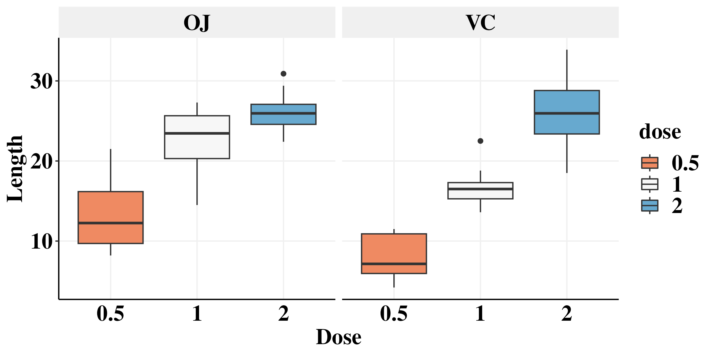

```{r, include = FALSE}
knitr::opts_chunk$set(
  collapse = TRUE,
  comment = "#>",
  out.width = "100%", 
  eval = FALSE
)
```

```{r}
library(datasets)
library(tidyverse)
```

```{r}
path <- "/aryeelab/users/corri/Oct24_Presentation/Aryee_LM_Oct24_2023/Figures/"
```

# Toothgrowth dataset 
The ToothGrowth data set in R shows tooth growth in guinea pigs after receiving vitamin C at various doses with either orange juice (“OJ”) or ascorbic acid tablet (“VC”) as the delivery method.

```{r}
ToothGrowth$dose <- as.factor(ToothGrowth$dose)
```

```{r, fig.width = 8, fig.height = 4}
# Change box plot colors by groups
p<-ggplot(ToothGrowth, aes(x=dose, y=len, fill = dose)) +
  geom_boxplot()+
  theme_classic()+
  theme(panel.grid.major = element_line(color = "#f0f0f0",
                                        size = 0.5))+
  theme(plot.title = element_text(color = "black", family = "Times New Roman", size = 18, face = "bold"),
        axis.text.x = element_text(color = "black", family = "Times New Roman", size = 18,face = "bold"),
        axis.text.y = element_text(color = "black", family = "Times New Roman", size = 18,face = "bold"),
        axis.title.x = element_text(color = "black", family = "Times New Roman", size = 18,face = "bold"),
        axis.title.y = element_text(color = "black", family = "Times New Roman", size = 18,face = "bold"),
        axis.ticks.x=element_blank(),
        legend.text=element_text(color = "black", family = "Times New Roman", size =18,face = "bold"),
        legend.title=element_text(color = "black", family = "Times New Roman", size = 18,face = "bold"),
        strip.text.x = element_text(color = "black", family = "Times New Roman", size = 18,face = "bold"),
        strip.background=element_rect(colour="#f0f0f0",fill="#f0f0f0"))+
  scale_fill_brewer(palette="RdBu") +
  xlab("Dose")+
  ylab("Length") +
  facet_wrap(~supp)
p

ggsave(paste0(path,"Example_plot1.png"), width=8, height=4)
```




